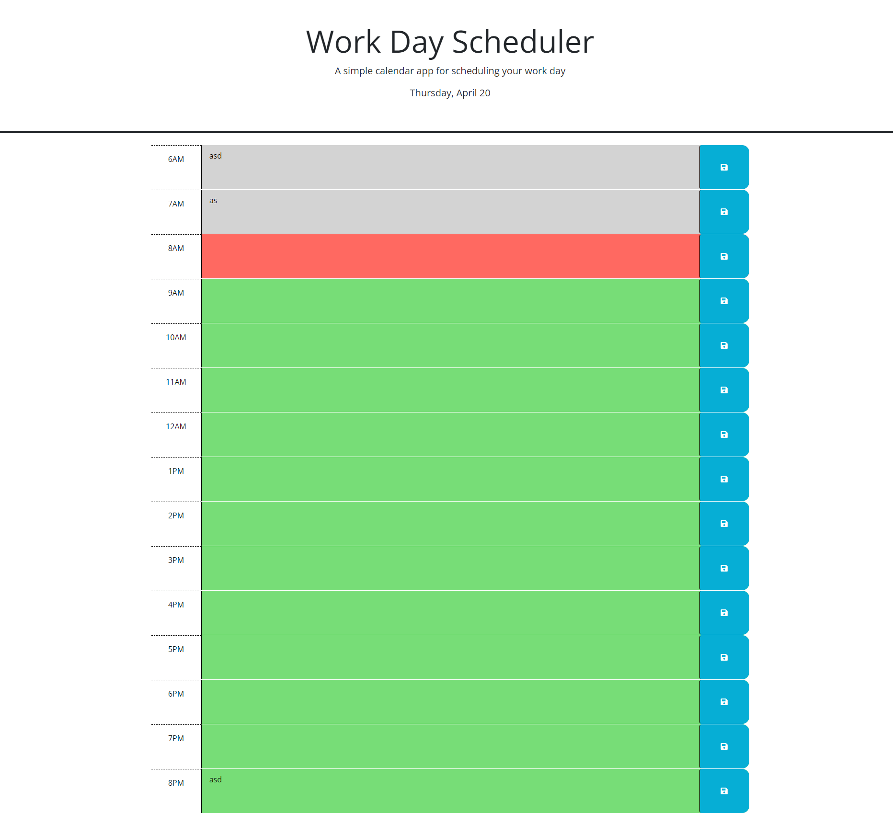

# 05 Third-Party APIs: Work Day Scheduler

## Your Task

Create a simple calendar application that allows a user to save events for each hour of the day by modifying starter code. This app will run in the browser and feature dynamically updated HTML and CSS powered by jQuery.

You'll need to use the [Day.js](https://day.js.org/en/) library to work with date and time. Be sure to read the documentation carefully and concentrate on using Day.js in the browser.

## User Story

```md
AS AN employee with a busy schedule
I WANT to add important events to a daily planner
SO THAT I can manage my time effectively
```

## Acceptance Criteria

```md
GIVEN I am using a daily planner to create a schedule
WHEN I open the planner
THEN the current day is displayed at the top of the calendar
WHEN I scroll down
THEN I am presented with timeblocks for standard business hours
WHEN I view the timeblocks for that day
THEN each timeblock is color coded to indicate whether it is in the past, present, or future
WHEN I click into a timeblock
THEN I can enter an event
WHEN I click the save button for that timeblock
THEN the text for that event is saved in local storage
WHEN I refresh the page
THEN the saved events persist
```
## what the steps does
Get the current hour in 24-hour time using the dayjs library.

Add the appropriate class (past, present, or future) to each time block based on the current time.

The time blocks are represented by HTML elements with the class "time-block" and an id of the format "hour-[hour number]".

The past class is added to time blocks for hours before the current hour, present class is added to the time block for the current hour, and future class is added to time blocks for hours after the current hour.

Add a click event listener to the save buttons.

When a user clicks the save button associated with a time block, the user's input in the textarea of that time block is saved to local storage with the time block's id as the key.

Load any saved user input from local storage and display it in the appropriate textarea of each time block.

Display the current date in the header of the page using dayjs.

Overall, this code provides a simple and effective way for users to plan their daily tasks and track their progress.

